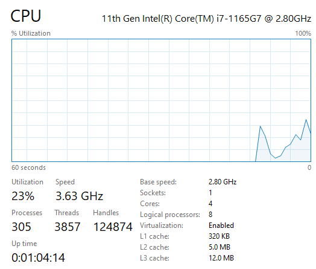
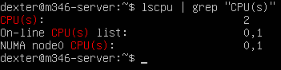
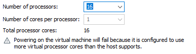
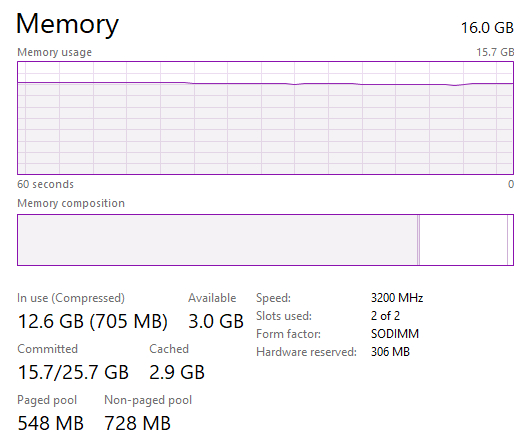
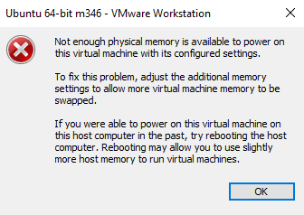

# KN01

## Ressourceneinteilung

### CPU Prozessoren
    

### CPU Prozessoren weniger als Host-System

### CPU Prozessoren mehr als Host-System

### RAM

### RAM weniger als Host-System

### RAM mehr als Host-System

### Erklärungen zu Fehlermeldungen

Da ich den Typ 2 der Ressourceneinteilung verwende, erlaubt mir die Virtualisierung höchstwahrscheinlich nicht, mehr Ressourcen für meine Gast-OS einzuteilen, als ich physisch auf meiner Host-OS besitze.
