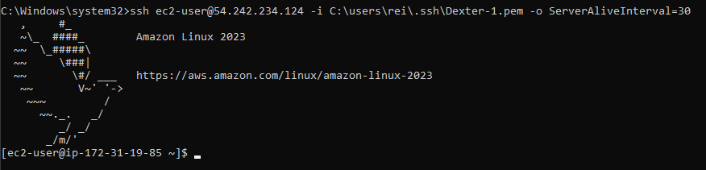

# KN02

## Lab 4.1 - EC2

### HTML-Seite

### Liste der EC2-Instanzen

### Details der Web Server-Instanz (öffentliche IP sichtbar)

### Security-Group

## Lab 4.2 - S3

### Liste der Buckets

### HTML-Seite

### Liste der Dateien im Bucket

### Eigenschaften von "Static website hosting"

### JSON-Datei mit der Bucket-Policy für den öffentlichen Zugriff
{
    "Version": "2012-10-17",
    "Statement": [
        {
            "Sid": "PublicReadGetObject",
            "Effect": "Allow",
            "Principal": "*",
            "Action": "s3:GetObject",
            "Resource": "arn:aws:s3:::dexters3bucket/*"
        }
    ]
}

## Zugriff mit SSH-Key

### Verwendung 1. Schlüssel

### Verwendung 2. Schlüssel

### Instanz-Details
