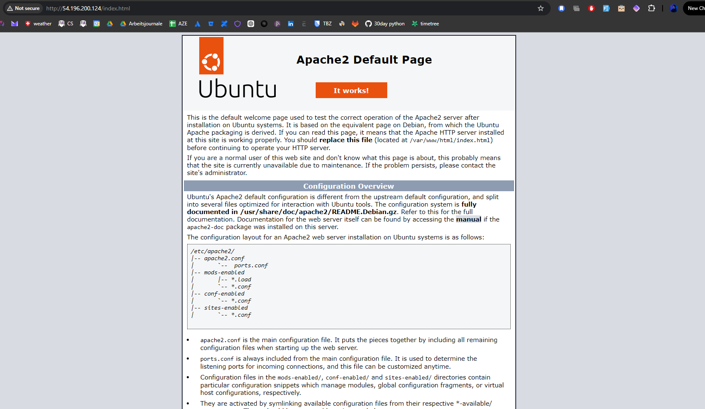
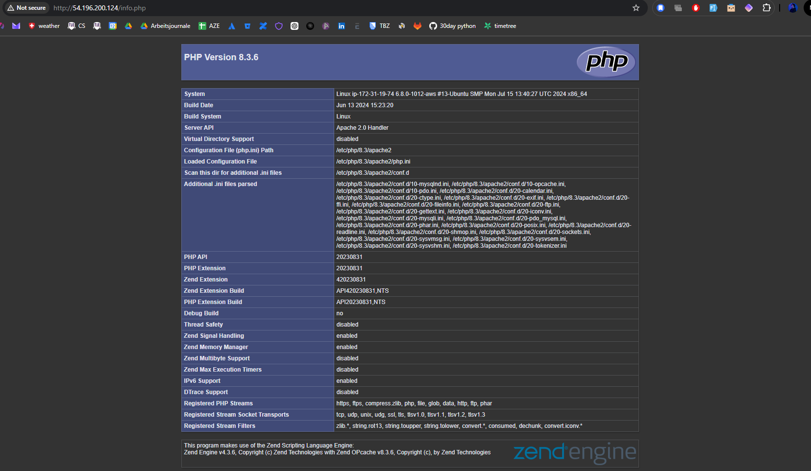
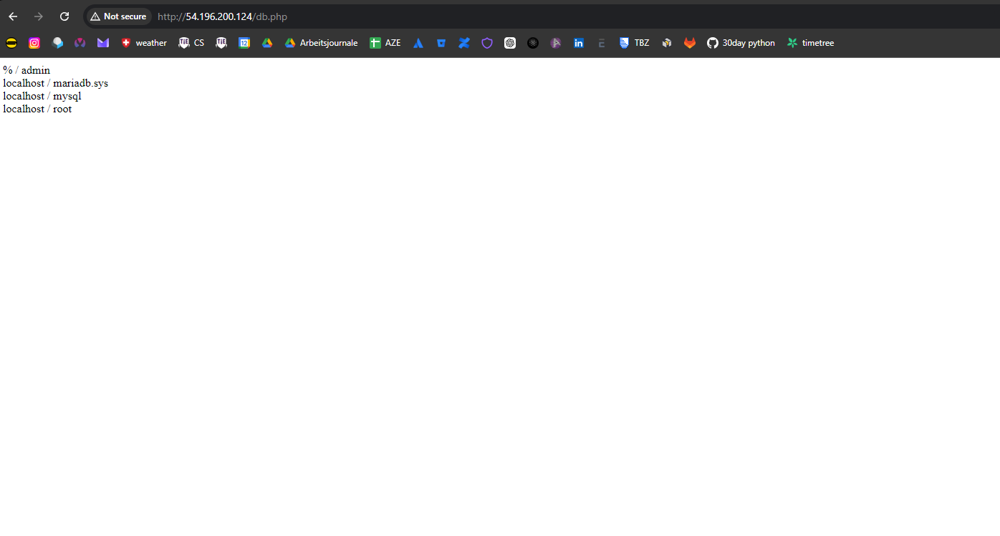
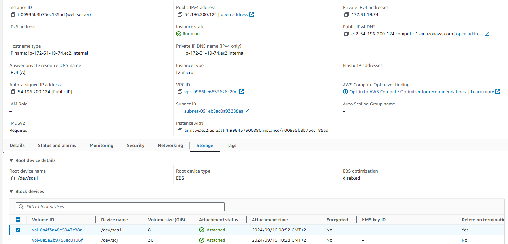

# Iaas - Virtuelle Server

## Installation Webservers

### Funktionierende Webseiten

## Elastic Block Storage hinzufügen

### Liste der Volumen 

### Erklärung, für was das zusätzliche Volumen verwendet werden könnte
Das zusätzliche Volumen kann für Daten verwendet werden, die nicht in das Root-Volumen sein müssen. Das könnte Logging-Dateien, Backup-Dateien, Datenbank-Dateien, etc. sein.

