# Netwerk und Sicherheit

## Diagramm erstellen
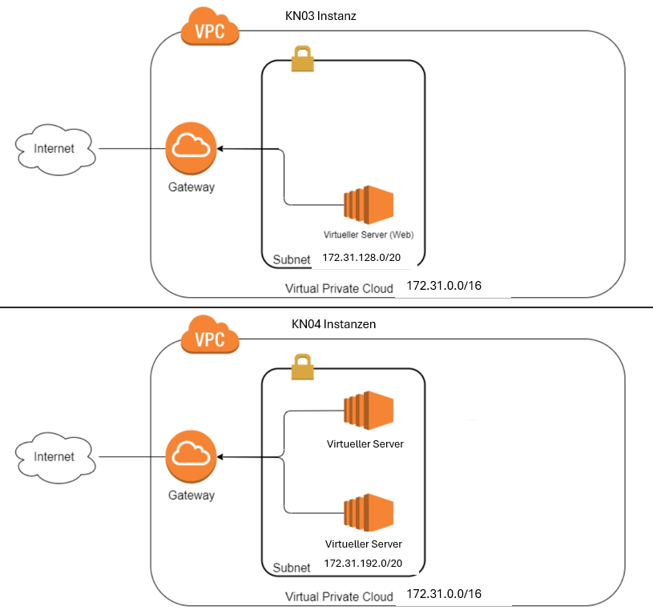

## Subnetz und private IP wählen
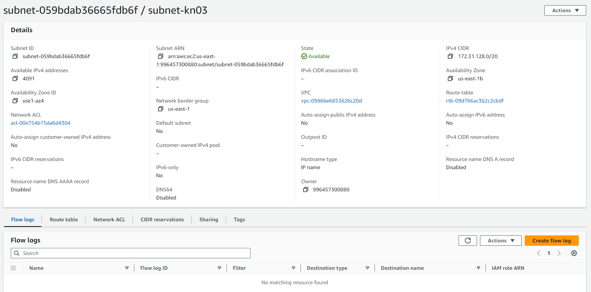
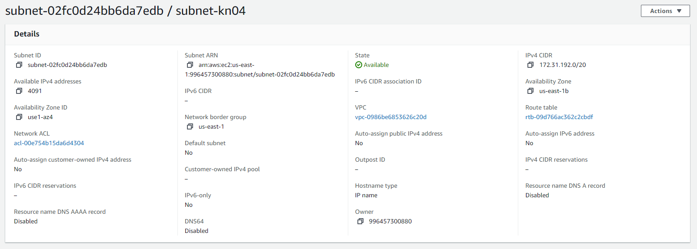

Gewählte IP-Adressen: 172.31.192.10 & 172.31.192.20

## Objekte und Instanzen erstellen

### Sicherheitsgruppen
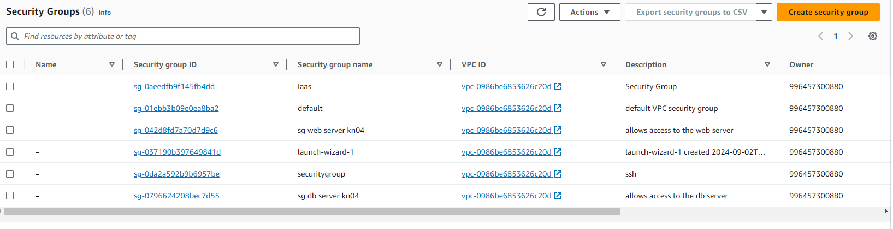
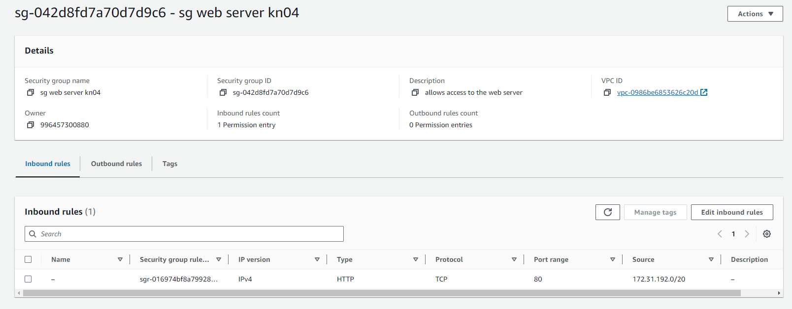
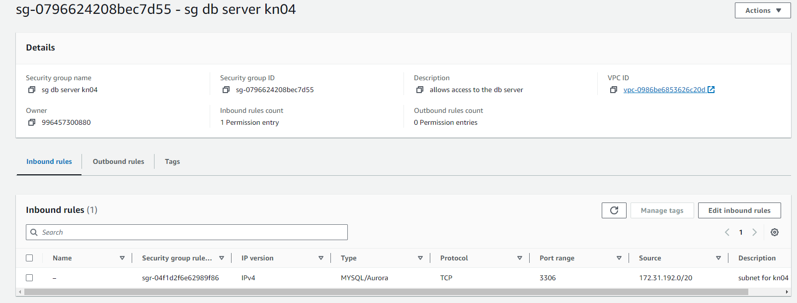

### Öffentliche, statische IPs
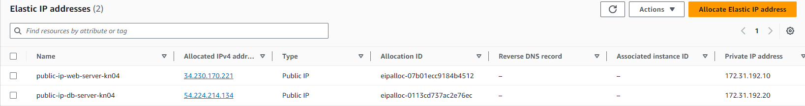

#### Netwerkinterfaces
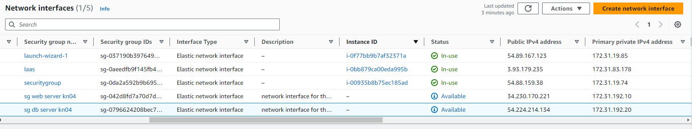

### Instanzen erstellen
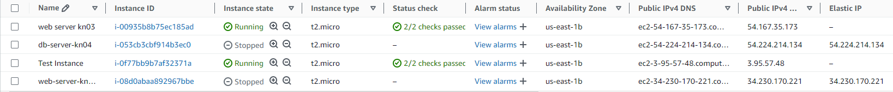

#### Details DB
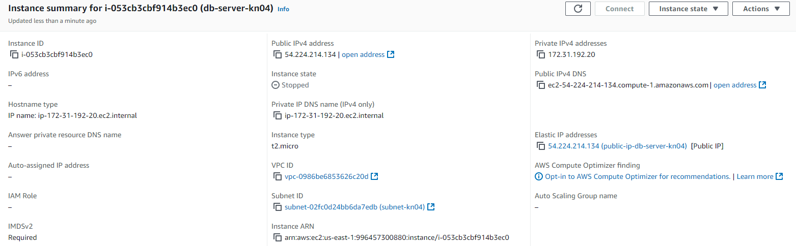

#### Details Webserver

### Dateinanpassungen
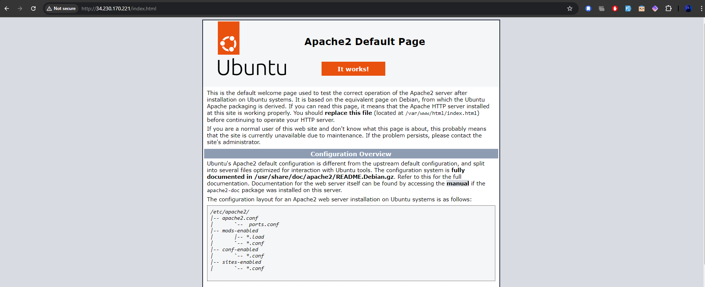
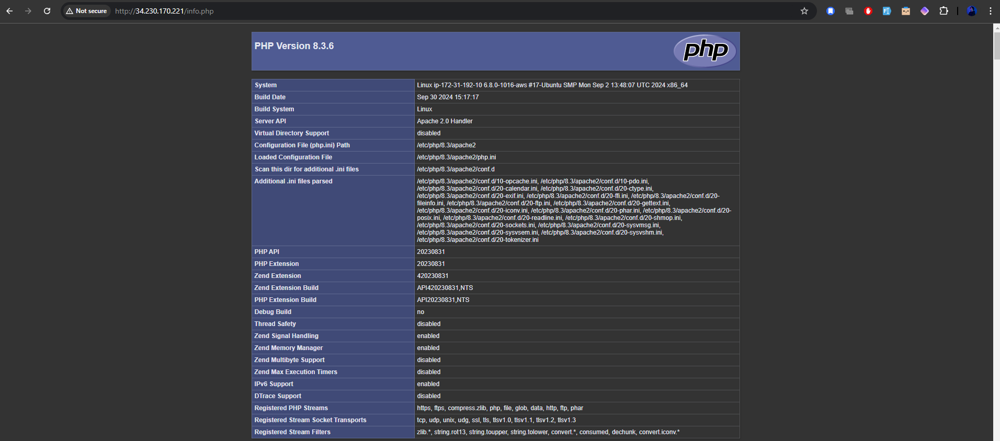
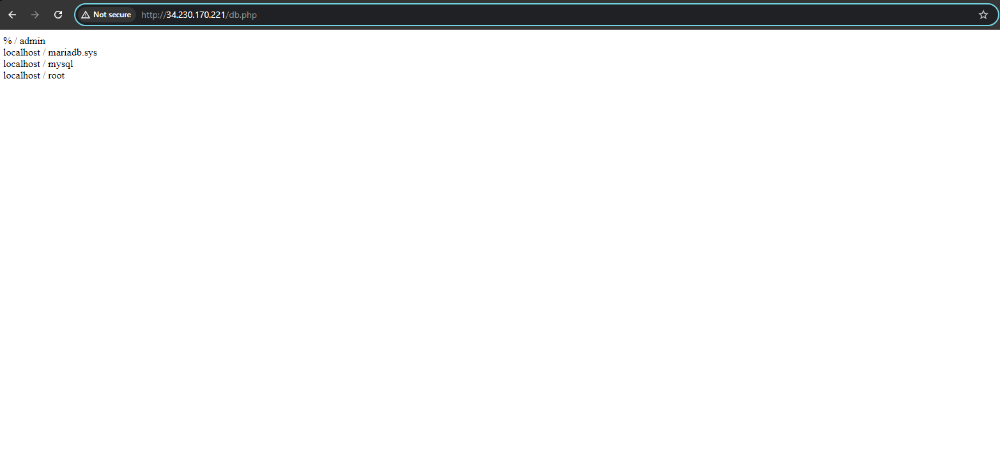