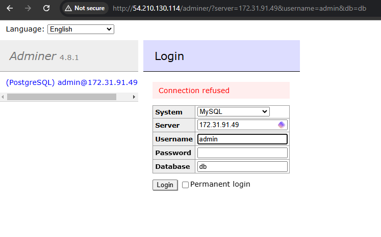

# Cloud-init und AWS

## Cloud-init Datei Verstehen
users: # Konfiguriert eine Gruppe von Benutzern
  - name: ubuntu  # Erstellt einen Benutzer mit dem Namen 'ubuntu'
    sudo: ALL=(ALL) NOPASSWD:ALL  # Erteilt dem Benutzer 'ubuntu' Sudo-Rechte ohne Passwortabfrage
    groups: users, admin  # Fügt den Benutzer 'ubuntu' zu den Gruppen 'users' und 'admin' hinzu
    home: /home/ubuntu  # Legt das Home-Verzeichnis des Benutzers 'ubuntu' fest
    shell: /bin/bash  # Setzt die Standard-Shell für 'ubuntu' auf /bin/bash
    ssh_authorized_keys:  # Liste der öffentlichen SSH-Schlüssel, die für den Benutzer 'ubuntu' autorisiert werden
      - ssh-rsa AAAAB3NzaC1yc2EAAAADAQABAAABAQC0WGP1EZykEtv5YGC9nMiPFW3U3DmZNzKFO5nEu6uozEHh4jLZzPNHSrfFTuQ2GnRDSt+XbOtTLdcj26+iPNiFoFha42aCIzYjt6V8Z+SQ9pzF4jPPzxwXfDdkEWylgoNnZ+4MG1lNFqa8aO7F62tX0Yj5khjC0Bs7Mb2cHLx1XZaxJV6qSaulDuBbLYe8QUZXkMc7wmob3PM0kflfolR3LE7LResIHWa4j4FL6r5cQmFlDU2BDPpKMFMGUfRSFiUtaWBNXFOWHQBC2+uKmuMPYP4vJC9sBgqMvPN/X2KyemqdMvdKXnCfrzadHuSSJYEzD64Cve5Zl9yVvY4AqyBD aws-key
      \# SSH-Schlüssel

Konfiguriert die Passwortauthentifizierung für SSH
ssh_pwauth: false  # Deaktiviert die Passwort-Authentifizierung für SSH, sodass nur der Zugriff per Schlüssel erlaubt ist

\# Konfiguriert den Zugriff auf den Root-Benutzer
disable_root: false  # Aktiviert den Zugriff für den Root-Benutzer auf die Instanz

\# Konfiguriert die Paketaktualisierung
package_update: true  # Aktualisiert die Paketliste, um sicherzustellen, dass die neuesten Versionen installiert werden können

\# Installiert zusätzliche Pakete
packages:
  - curl  # Installiert 'curl'
  - wget  # Installiert 'wget'

## SSH-Key und Cloud-init
### Cloud-init Datei im KN05 Ordner
### Details Instanz mit "Key pair assigned at launch"

### ssh-Befehl 1. Key

### ssh-Befehl 2. Key

### Auszug Clout-Init-Log

## Template
Im KN05 Ordner

## Installation automatisieren

### index.html

### info.php

### db.php

### adminer

geht nicht

### Alle init Dateien im KN05 Ordner
