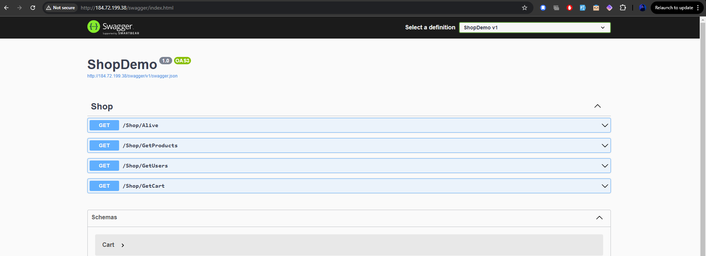
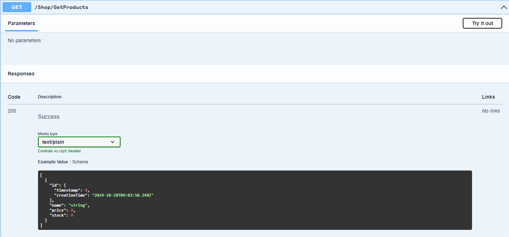
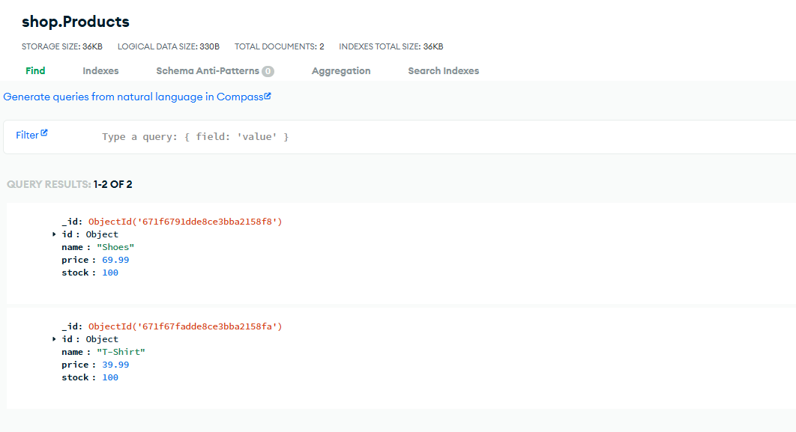
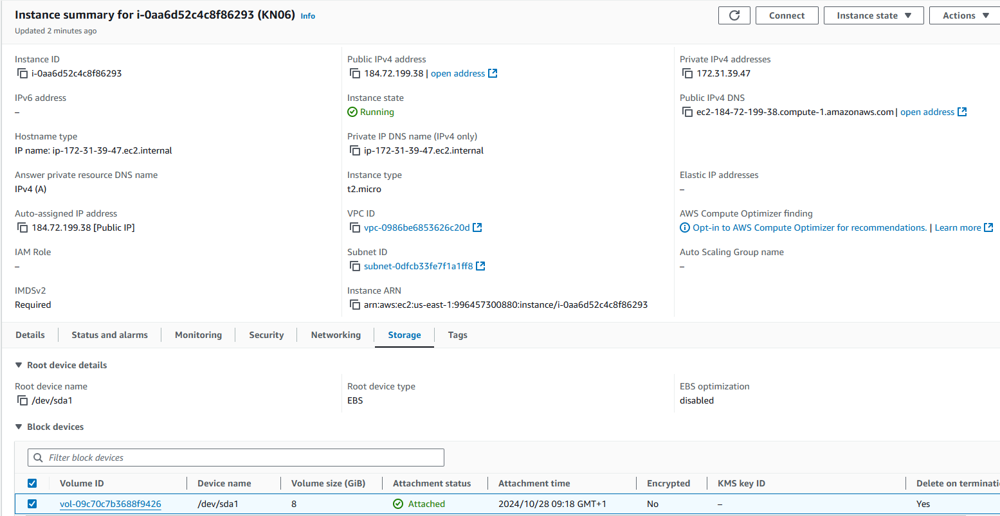
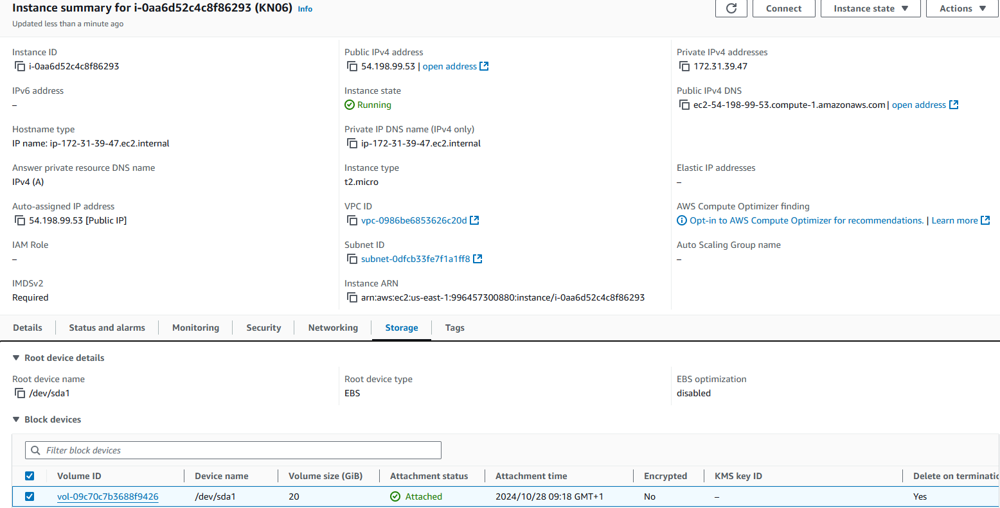
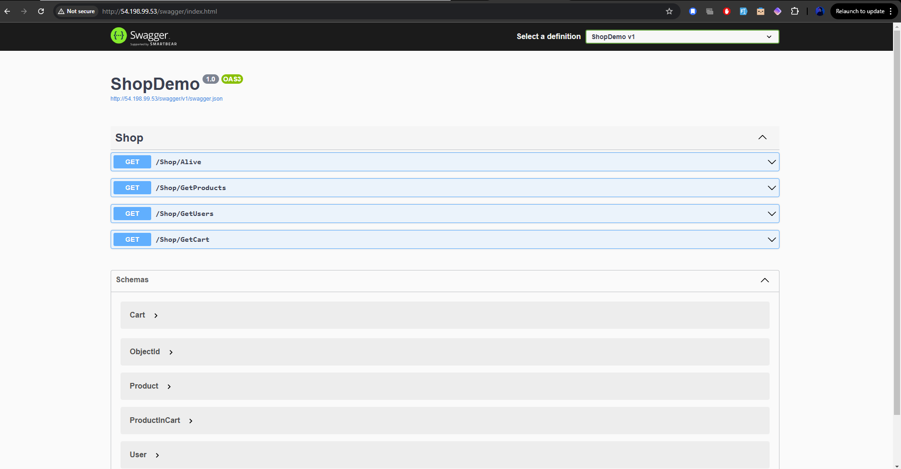
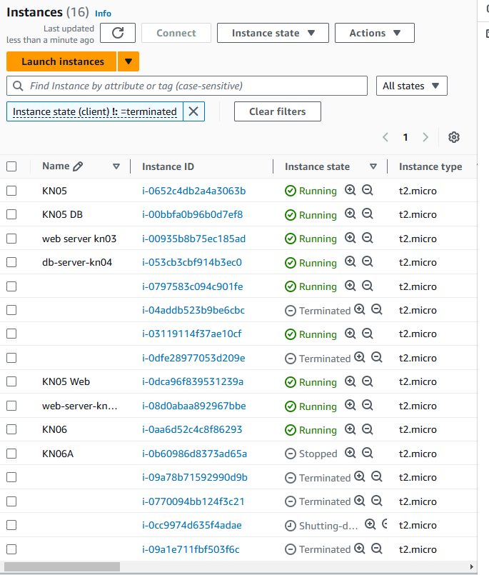
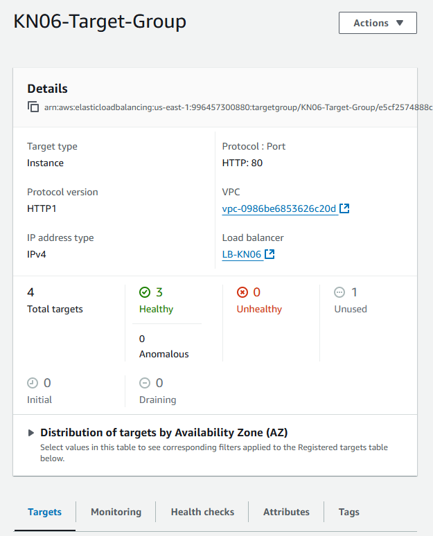
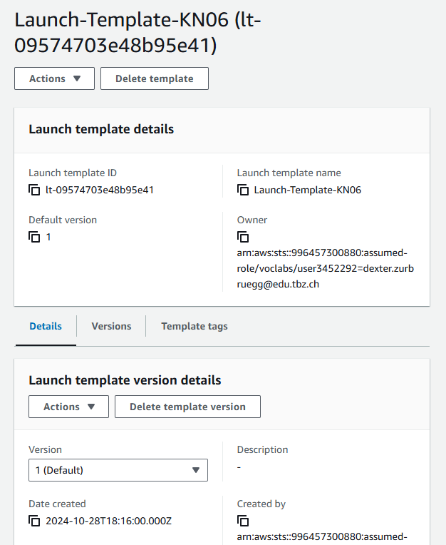
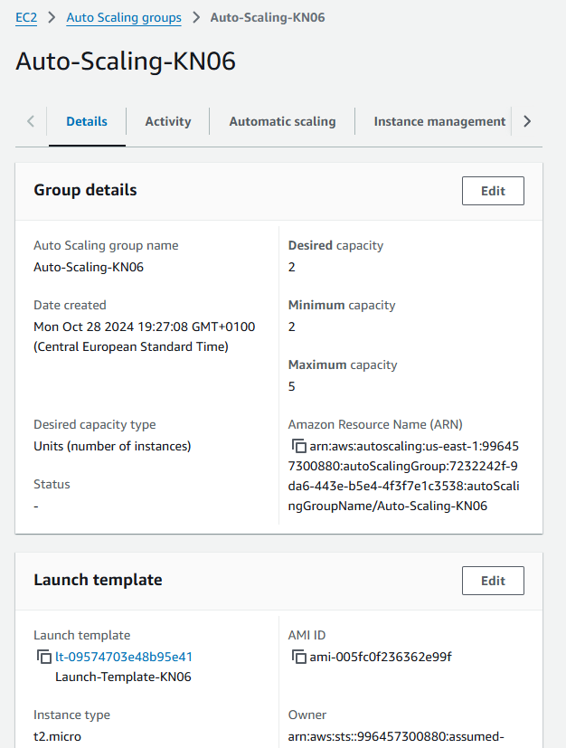

# Skalierung

## Installation App

### Reverse Proxy
Ein Reverse Proxy ist ein Server, der Anfragen von Clients entgegennimmt und sie an einen oder mehrere Backend-Server weiterleitet. Er wird dabei auch oft für die Validierung von SSL/TLS und für Load Balancing verwendet.

### Swagger


### Swagger GetProducts


### MongoDB Collections


## Vertikale Skalierung

### Vorher Disk Storage


### Nacher Disk Storage


### Erklärung Disk Storage & Instanztyp
Ich musste für der erweiterten Disk Storage bloss das Volume anpassen. Das Wechseln vom Instanztyp während die Instanz noch läuft ist jedoch nicht möglich. Man muss dafür die Instanz stoppen um den Instanztyp zu verändern.

## Horizontale Skalierung

### Erklärung
Um die Applikation unter der URL app.tbz-m346.ch verfügbar zu machen, sollte ein CNAME-Record erstellt werden. Dieser verknüpft die URL app.tbz-m346.ch (z. B. dexter.app.tbz-m346.ch) mit dem DNS-Namen des Load Balancers kn06-lb-1218975619.us-east-1.elb.amazonaws.com

### Laufende Umgebung


## Auto-Skalierung

### Instanzen


### Target Group


### Launch Template


### Auto Scaling Group


## Evaluation Cloud-Init
Direkt im Skript gegebene Passwörter und Zugangsdaten sind leicht auszulesen und sind ein erhebliches Sicherheitsrisiko. Cloud-Init speichert Konfigurationsdaten beim Serverstart in den Metadaten, und sollte jemand Zugriff auf diese Metadaten erhalten, könnten die hardgecodeten Zugangsdaten missbraucht werden

Beispiel:

````
sudo sed -i 's/<clusterUrl>/kn06.fw5kx.mongodb.net//g' /home/ubuntu/m346scripts/KN06/dotnet/appsettings.json
sudo sed -i 's/<username>/username/g' /home/ubuntu/m346scripts/KN06/dotnet/appsettings.json
sudo sed -i 's/<password>/password/g' /home/ubuntu/m346scripts/KN06/dotnet/appsettings.json
sudo cp -r /home/ubuntu/m346scripts/KN06/dotnet/* /var/www/app/
````