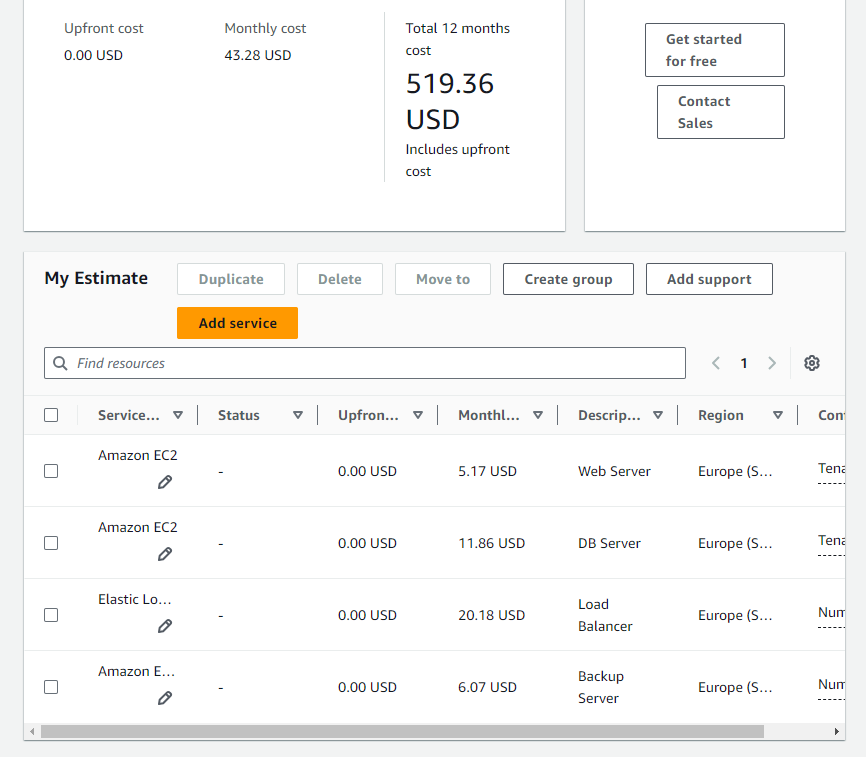

# KN10: Kostenberechnung

## Kostenberechnung erstellen

### Rehosting

#### AWS

#### Erklärung:
Ich habe mich für 4 Instanzen entschieden, die auf Shared Instances mit anderen Kunden-Instanzen laufen, um Geld zu sparen. Ich habe mich für den Webserver und DB-Server für EC2-Instanzen entschieden, was den Preis deutlich senkte.

#### Azure

#### Erklärung:
Ich habe mich hier ebenfalls für 4 Instanzen entschieden. Die DB-Instanz ist für Azure Instanzen ein wenig teurer als die AWS-Variante. Dafür konnte ich für den Load Balancer ein wenig Geld sparen. Grundsätzlich sind aber die Azure Anwendungen teurer als die AWS Anwendungen.

### Replatforming

#### Heroku

#### Erklärung:
Bei Heroku kann man leider keine genauen Anforderungen wie Speicherplatz, Arbeitsspeicher, etc. angeben, was das auswählen der Pläne mir erschwerte. Ich habe mich für Standard 1X und Performance M entschieden, um den Anforderungen der vorherigen Aufgabe gleichzustehen. Für die Datenbank habe ich mich für den Postgres Standard 0 entschieden, was den Anforderungen ähnelt.

### Repurchasing

#### Zoho CRM

#### Salesforce

#### Entscheidung:
Ich entscheide mich für Zoho CRM, einerseits wegen den Preisen aber auch, weil die genauen Benefits bei Zoho CRM viel klarer und verständlicher sind, als bei Salesforce Sales Cloud.

## Interpretation der Resultate
- Wie stark unterscheiden sich die Angebote?
Technisch gesehen kann ich nicht sehr viel dazu sagen, aber preislich haben die Angebote sehr grosse Unterschiede.

- Welches ist das Billigste?
Das billigste Angebot bietet Zoho CRM an, da alle anderen Angebote mehr als CHF50+ kosten, was das obere Limit von Zoho CRM mit 52 Euro übertrifft.

- Wieso ist eines davon viel teurer? Ist es aber wirklich teurer?

Ich vermute, dass Salesforce eine Lösung für grössere Firmen bietet, die komplexere und grössere Probleme bewältigen. Was ein weiterer Aspekt sein könnte, wäre die wahrscheinlich bessere Sicherheit bei Salesforce als bei anderen Anbietern.